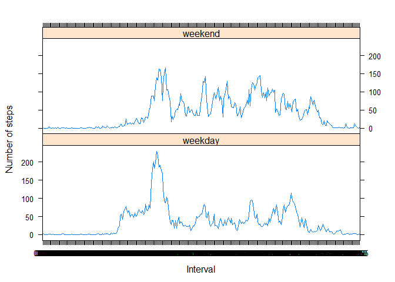

# PA1_template
Ned  
Wednesday, August 13, 2014  


## Loading and preprocessing the data

Read in raw data file, using "character" classes for all fields to assist with reformatting later


```r
rawdata <- read.csv("activity.csv", header=T, sep = ",", colClasses=c("character", "character", "character"))
```

Reformat the data into correct data types


```r
steps <- as.numeric(rawdata$steps)
dates <- as.Date(rawdata$date)
times <- as.numeric(rawdata$interval)
```

The times are in a format of hmm where rightmost 2 digits are minutes and rest hours. 

```r
hours <- times %/% 100
minutes <- times %% 100
times <- sprintf("%02d:%02d", hours, minutes)
```

Once all the data is cleansed, reassemble into a data frame for further analysis

```r
fitdata <- data.frame(dates,steps, times)
head(fitdata)
```

```
##        dates steps times
## 1 2012-10-01    NA 00:00
## 2 2012-10-01    NA 00:05
## 3 2012-10-01    NA 00:10
## 4 2012-10-01    NA 00:15
## 5 2012-10-01    NA 00:20
## 6 2012-10-01    NA 00:25
```

## What is mean total number of steps taken per day?
For this part of the assignment, you can ignore the missing values in the dataset.

Make a histogram of the total number of steps taken each day


```r
daysteps <- aggregate(fitdata$steps, list(fitdata$dates), sum)
names(daysteps) <- c("date", "numsteps")
hist(daysteps$numsteps, xlab = "Number of steps", main = "Frequency of steps per day", breaks = 100)
```

 

Calculate and report the mean and median total number of steps taken per day

```r
meansteps <- mean(daysteps$numsteps, na.rm=T)
mediansteps <- median(daysteps$numsteps, na.rm=T)
```

The mean total number of steps is 10766.188679
The median total number of steps is 10765.000000

## What is the average daily activity pattern?

Make a time series plot (i.e. type = "l") of the 5-minute interval (x-axis) and the average number of steps taken, averaged across all days (y-axis)

```r
intervalsteps <- aggregate(fitdata$steps, list(fitdata$times), function(x) mean(x, na.rm=T))
names(intervalsteps) <- c("interval", "avgsteps")
plot(intervalsteps$interval, intervalsteps$avgsteps, type="l",  main="Avg steps per interval", xlab="Time interval", ylab="Avg number of steps")
lines(intervalsteps$interval, intervalsteps$avgsteps, type="l")
```

 

Which 5-minute interval, on average across all the days in the dataset, contains the maximum number of steps?

```r
maxavgsteps <- intervalsteps[which.max(intervalsteps$avgsteps),]
```
Maximum number of steps averaged across all days occurs at 08:35


## Imputing missing values

```r
nummissing <- length(fitdata[is.na(fitdata$steps), 1])
```
There are 2304 missing values

Devise a strategy for filling in all of the missing values in the dataset. The strategy is the mean for that 5-minute interval. Create a new dataset that is equal to the original dataset but with the missing data filled in.


```r
nasteps <- which(is.na(fitdata$steps))
natimes <- fitdata[nasteps, "times"]
missingvals <- data.frame(nasteps, natimes, intervalsteps[natimes,"avgsteps"])
names(missingvals) <- c("rowindex", "interval", "avgsteps")
filledfitdata <- fitdata
filledfitdata[missingvals$rowindex, "steps"] <- missingvals$avgsteps
head(filledfitdata)
```

```
##        dates   steps times
## 1 2012-10-01 1.71698 00:00
## 2 2012-10-01 0.33962 00:05
## 3 2012-10-01 0.13208 00:10
## 4 2012-10-01 0.15094 00:15
## 5 2012-10-01 0.07547 00:20
## 6 2012-10-01 2.09434 00:25
```


Make a histogram of the total number of steps taken each day and Calculate and report the mean and median total number of steps taken per day. 


```r
daysteps2 <- aggregate(filledfitdata$steps, list(filledfitdata$dates), sum)
names(daysteps2) <- c("date", "numsteps")
hist(daysteps2$numsteps, xlab = "Number of steps", main = "Frequency of steps per day", breaks = 100)
```

 

```r
meansteps2 <- mean(daysteps2$numsteps, na.rm=T)
mediansteps2 <- median(daysteps2$numsteps, na.rm=T)
```

Do these values differ from the estimates from the first part of the assignment? 
Unfilled data : mean 10766.188679

Filled data : mean 10766.188679

Difference of 0

Unfilled data : median 10765.000000

Filled data : median 10766.188679

Difference of -1.1887


What is the impact of imputing missing data on the estimates of the total daily number of steps?

While the mean did not vary, the median varied slightly. 


## Are there differences in activity patterns between weekdays and weekends?

Create a new factor variable in the dataset with two levels – “weekday” and “weekend” indicating whether a given date is a weekday or weekend day.

```r
filledfitdata$dayofweek <- weekdays(filledfitdata$dates, T)
filledfitdata$weekday <- TRUE
filledfitdata$weekday[ filledfitdata$dayofweek %in% c("Sat", "Sun") ] <- FALSE
filledfitdata$daytype[ filledfitdata$weekday ] <- "weekday"
filledfitdata$daytype[ !filledfitdata$weekday ] <- "weekend"
filledfitdata$daytype <- as.factor(filledfitdata$daytype)
str(filledfitdata)
```

```
## 'data.frame':	17568 obs. of  6 variables:
##  $ dates    : Date, format: "2012-10-01" "2012-10-01" ...
##  $ steps    : num  1.717 0.3396 0.1321 0.1509 0.0755 ...
##  $ times    : Factor w/ 288 levels "00:00","00:05",..: 1 2 3 4 5 6 7 8 9 10 ...
##  $ dayofweek: chr  "Mon" "Mon" "Mon" "Mon" ...
##  $ weekday  : logi  TRUE TRUE TRUE TRUE TRUE TRUE ...
##  $ daytype  : Factor w/ 2 levels "weekday","weekend": 1 1 1 1 1 1 1 1 1 1 ...
```

Make a panel plot containing a time series plot (i.e. type = "l") of the 5-minute interval (x-axis) and the average number of steps taken, averaged across all weekday days or weekend days (y-axis).

```r
interval_avgsteps_daytype <- aggregate(filledfitdata$steps, list(filledfitdata$times, filledfitdata$daytype), function(x) mean(x, na.rm=T))
names(interval_avgsteps_daytype) <- c("interval", "daytype", "avgsteps")
with(interval_avgsteps_daytype, xyplot(avgsteps~interval|daytype, layout=c(1,2), type="l", xlab = "Interval", ylab = "Number of steps"))
```

 

As can be seen above, weekdays activity starts earlier in the day and has a higher peak but lower activity throughout the rest of the day compared to weekends.


       THE END
       
       
       
